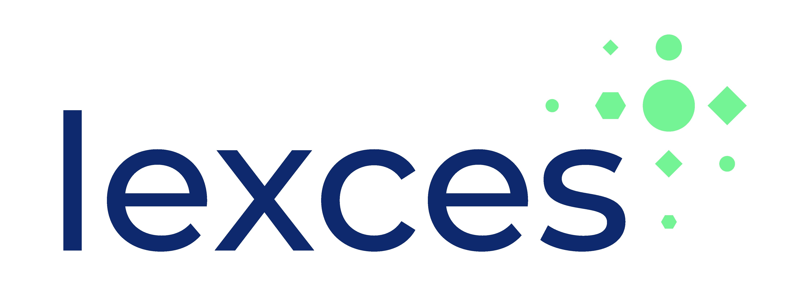

<div align="center">
  <a href="https://www.lexces.nl">
    
  </a>
</div>

# Evaluation of a silicosis diagostic prediction rule

**Under Construction** 🚧

[](https://utrechtuniversity.github.io/lexces-silicosis-predict/)

This repository contains the code and documentation for the evaluation of a diagnostic prediction rule for silicosis, which was developed in the Netherlands [see 2007 research paper](https://oem.bmj.com/lookup/doi/10.1136/oem.2006.027904) to rule out pneumoconiosis and identify workers at high risk for further diagnostic workup. Simulated data is used to replicate samples with similar summary characteristics as those provided in the original study, and different scenarios are simulated by incorporating outcome misclassification rates.

[Lexces](https://www.lexces.nl/) aims to prevent new cases of silicosis in Dutch workers. For this, [a Health Surveillance Program (HSP) for respiratory occupational diseases is being developed](https://www.lexces.nl/en/node/52). The diagnostic prediction rule could be incorporated as part of the HSP. However, the diagnostic rule was developed in the past with chest x-rays (CXR) as the reference standard for the diagnosis of silicosis. Recently, there have been concerns of [suboptimal diagnostic performance of CXR for the diagnosis of silicosis](https://onlinelibrary.wiley.com/doi/10.1111/resp.14755). Thus, the current work aims to assess the potential impact of misclassification error on the diagnostic rule's performance, and to scope for potential alternative diagnostic and prediction models for silicosis/pneumoconiosis. 

## How to use 

Note: This repository is a work in progress and full reproducibility and re-use may not me granted at this point. Please use with caution. 

The suggested use of this repository starts with making sure that R and RStudio are installed in your computer:
1. Install [R and RStudio](https://posit.co/download/rstudio-desktop/) on your computer if you haven't done so. (Note that these analyses were conducted under R version 4.4.1 and RStudio 2024.04.2).
2. [Clone this repository](https://docs.github.com/en/repositories/creating-and-managing-repositories/cloning-a-repository). If you do not know how to do this, [you can follow these instructions](https://docs.github.com/en/desktop/overview/getting-started-with-github-desktop). Alternatively, you can [download the ZIP file](https://github.com/UtrechtUniversity/lexces-silicosis-predict/archive/refs/heads/main.zip), unpack it, and place it in a folder in your computer.
3. You should now have all these files in your computer with an identical folder structure (described in the following section).
4. In the main directory, open the file named ***lexces-silicosis-predict.Rproj*** in RStudio.
5. You can navigate through the folders on the right-bottom panel of R Studio. Open the **R** folder. You should now see a series of files ending with ***.qmd***.
6. Open one of the .qmd files. You can run every chunk of code sequentially to reproduce the analyses. Make sure to respect the order and if something fails, I recommend that you start running al chunks of code from the beginning. If you don't know how to run a chunk of code, you can [imitate what this person is doing](https://youtu.be/RPF6gGyeJmg?feature=shared&t=30). If you get a message saying "Access denied", change from *Visual* to *Source* mode which can be done with the Ctrl+Shift+F4 command.
7. Please note that scripts are meant to be sourced into the flow of analyses in the main .qmd files. You may encounter problems if you attempt to run the scripts independently. 

If you are not able to follow the prior steps, you may also consider reviewing the [PDF reports](docs/reports) documenting the analyses. 

Currently, there is only one relevant .qmd file linked to the R scripts and analyses: 

-   [Misclassification error of silicosis diagnostic prediction rule](R/Silicosis_diagnostic_rule.qmd). Link to the report: [PDF](docs/Silicosis_diagnostic_rule.pdf)

The Amua folder contains code for a mock screening decision model for the [Topics in Medical Decision Making course](https://www.nihes.com/course/el004_topics_in_medical_decision_making_/). 

Although I have made significant efforts to ensure reproducibility of this project, I encourage you to [contact me](mailto:j.mancillagalindo@uu.nl) or post a request in this repository in case you encounter any issues.   

## Project Structure

The project structure distinguishes three kinds of folders:
- read-only (RO): not edited by either code or researcher
- human-writeable (HW): edited by the researcher only.
- project-generated (PG): folders generated when running the code; these folders can be deleted or emptied and will be completely reconstituted as the project is run.

```         
.
├── .gitignore
├── CITATION.cff
├── LICENSE
├── README.md
├── lexces-silicosis-predict.Rproj
├── amua                  <- Decision models using Amua. (HW)
├── data                  <- All project data files
│   ├── processed         <- The final, canonical data sets for modeling. (PG)
│   ├── raw               <- The original, immutable data. (RO)
│   └── temp              <- Intermediate data that has been transformed. (PG)
├── docs                  <- Documentation for users (HW)
│   ├── manuscript        <- Manuscript source, docx. (HW)
│   ├── presentations     <- Presentations, pptx, pdf. (HW)
│   └── reports           <- Project reports, pdf. (HW)
├── results
│   ├── output_figures    <- Figures for the manuscript or reports (PG)
│   └── output_tables     <- Output tables for the manuscript (PG)
└── R                     <- Source code for this project (HW)
    ├── scripts           <- Scripts sourced in main R markdown documents (PG)
    └── sessions          <- Text files with information of R sessions (PG)

```

## License

This project is licensed under the terms of the [MIT License](/LICENSE). 

Permission to use the Lexces logo for this project has been obtained. Please refer to their [copyright notice](https://www.lexces.nl/en/copyright).

This project structure repository is adapted from the [Utrecht University simple R project template](https://github.com/UtrechtUniversity/simple-r-project), which builds upon the [Good Enough Project](https://github.com/bvreede/good-enough-project) Cookiecutter template by Barbara Vreede (2019).
